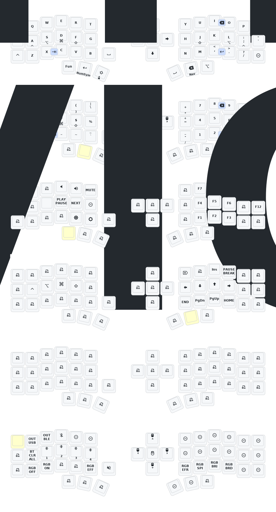

# AG Corne ZMK Repository

## Keymap Diagram

## Gem View

https://github.com/M165437/nice-view-gem

## Notes

**This keyboard is not the same as [foostan's Corne](https://github.com/foostan/crkbd). It will not work with standard `corne` firmware.**

If you need a 3D model of this keyboard, email `380465425@qq.com`.

1. Make sure the `eyelash_corne` project in [`config/west.yml`](config/west.yml) still works. The `boards/arm/eyelash_corne` folder will be downloaded from this URL.
2. If there is still a `boards/arm/eyelash_corne` folder in your fork, delete it.

